# Front-end-Mentor-Challenges

## 🛠 Skills

Javascript, HTML, CSS...

### This repo contains only frontend mentor challenges

## Demo

1.  QR Code Component => (https://abubakar-sadiq001.github.io/Front-end-Mentor-Challenges/01%20QR%20Code/QR%20Code.html)

2.  Blog Preview Card => (https://abubakar-sadiq001.github.io/Front-end-Mentor-Challenges/02%20Blog%20Preview%20card/Blog%20Preview%20card.html)

### Desktop design

3.  Social links Profile => (https://abubakar-sadiq001.github.io/Front-end-Mentor-Challenges/03%20Social%20links%20profile/Social%20links%20profile.html)

### Desktop design

4.  Recipe Page => (https://abubakar-sadiq001.github.io/Front-end-Mentor-Challenges/04%20Recipe%20page/recipe.html)

### Desktop design

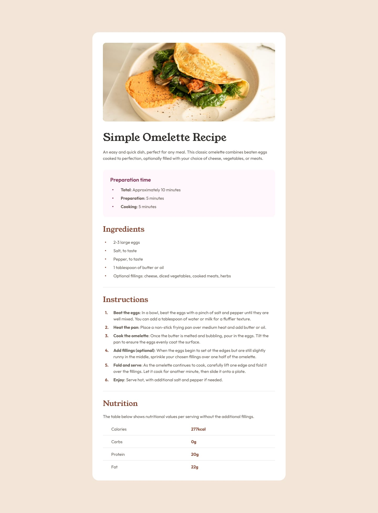

5.  Huddle Landing Page => (https://abubakar-sadiq001.github.io/Front-end-Mentor-Challenges/05%20Huddle%20landing%20page/Huddle%20page.html)

### Desktop design

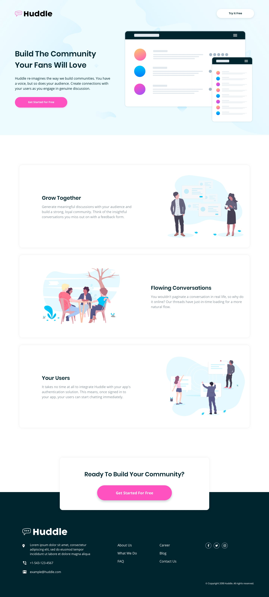

6.  Testimonials Grid Section => (https://abubakar-sadiq001.github.io/Front-end-Mentor-Challenges/06%20Testimonials%20grid%20section/index.html)

### Desktop design

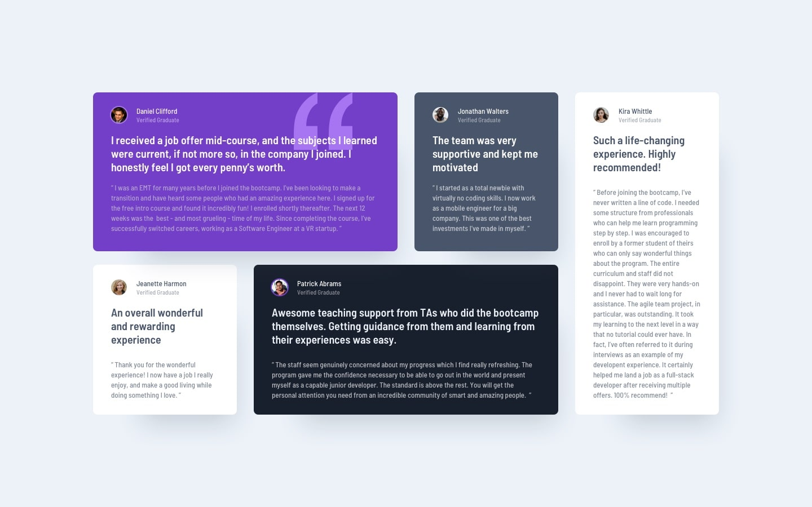

7.  Fylo Landing Page with two Column Layout => (https://abubakar-sadiq001.github.io/Front-end-Mentor-Challenges/07%20Fylo%20landing%20page%20with%20two%20column%20layout/index.html)

### Desktop design

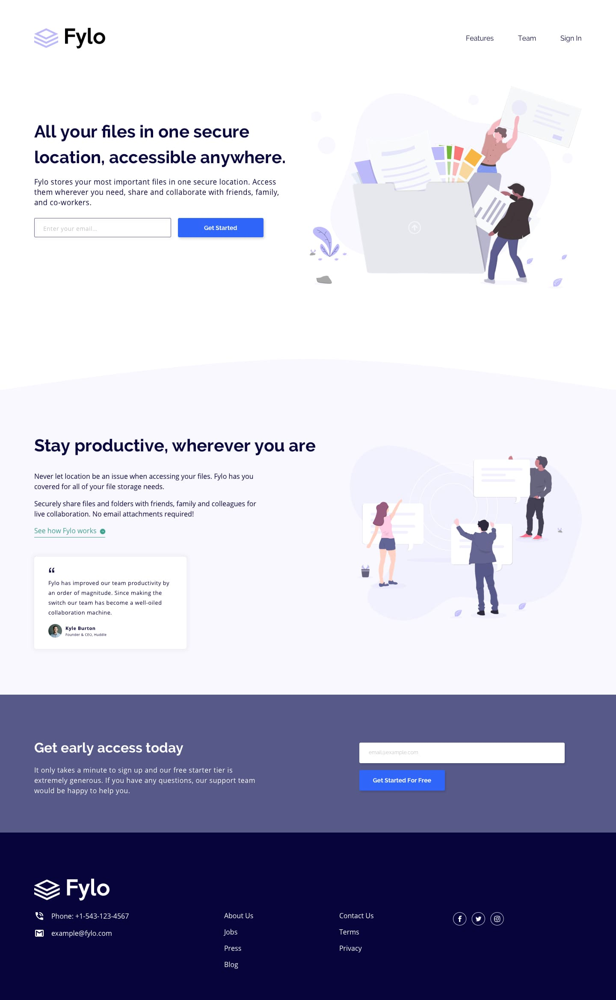

8.  Result Summary Componenet => (https://abubakar-sadiq001.github.io/Front-end-Mentor-Challenges/08%20Results%20summary%20component/index.html)

### Desktop design

9.  Product Preview Card => (https://abubakar-sadiq001.github.io/Front-end-Mentor-Challenges/09%20Product%20preview%20card/index.html)

### Desktop design

10. Clipboard Landing Page => (https://abubakar-sadiq001.github.io/Front-end-Mentor-Challenges/10%20Clipboard%20landing%20page/index.html)

### Desktop design

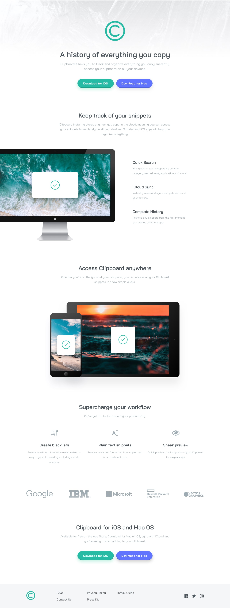

11. Order Summay Component => (https://abubakar-sadiq001.github.io/Front-end-Mentor-Challenges/11%20Order%20summary%20component/index.html)

### Desktop design

12. Stats Preview Component => (https://abubakar-sadiq001.github.io/Front-end-Mentor-Challenges/12%20Stats%20preview%20card%20component/index.html)

### Desktop design

13. 3 Column Preview Card => (https://abubakar-sadiq001.github.io/Front-end-Mentor-Challenges/13%203-column%20preview%20card/index.html)

### Desktop design

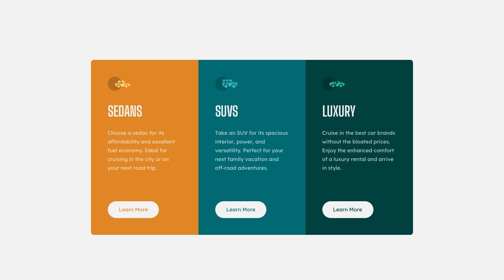

14. Profile Card Component => (https://abubakar-sadiq001.github.io/Front-end-Mentor-Challenges/14%20Profile%20card%20component/index.html)

### Desktop design

15. Single Price Grid Component => (https://abubakar-sadiq001.github.io/Front-end-Mentor-Challenges/15%20Single%20price%20grid%20component/index.html)

### Desktop design

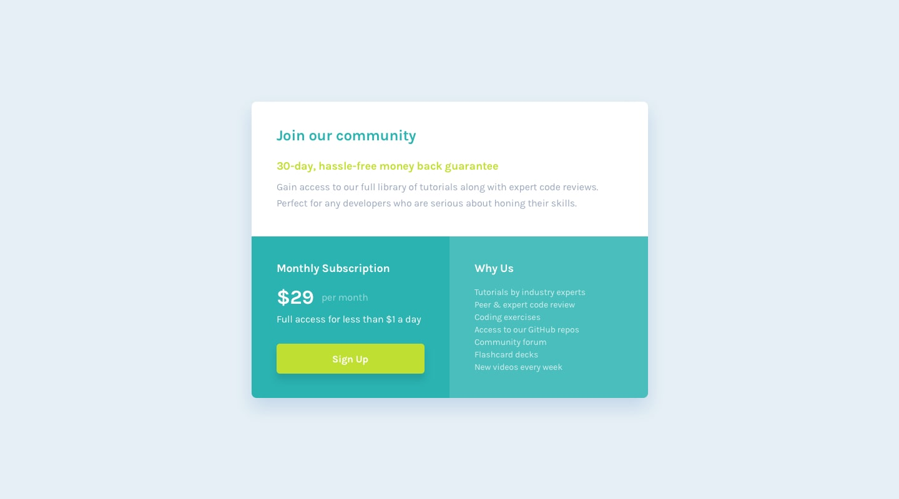

16. Four Card Feature Section => (https://abubakar-sadiq001.github.io/Front-end-Mentor-Challenges/16%20Four%20card%20feature%20section/index.html)

### Desktop design

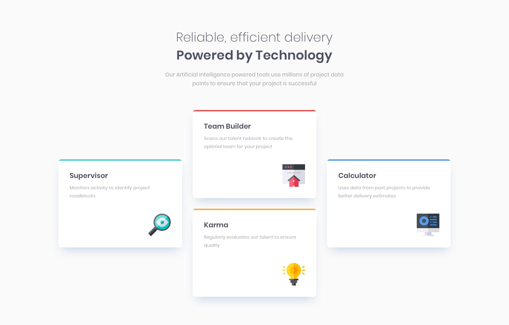

17. Huddle Landing with Curved Section => (https://abubakar-sadiq001.github.io/Front-end-Mentor-Challenges/17%20Huddle%20landing%20page%20with%20curved%20section/index.html)

### Desktop design

18. Huddle Landing Page with Single Introductory Section => (https://abubakar-sadiq001.github.io/Front-end-Mentor-Challenges/18%20Huddle%20landing%20page%20with%20single%20introductory%20section/index.html)

### Desktop design

19. Social Proof Section => (https://abubakar-sadiq001.github.io/Front-end-Mentor-Challenges/19%20Social%20proof%20section/index.html)

### Desktop design

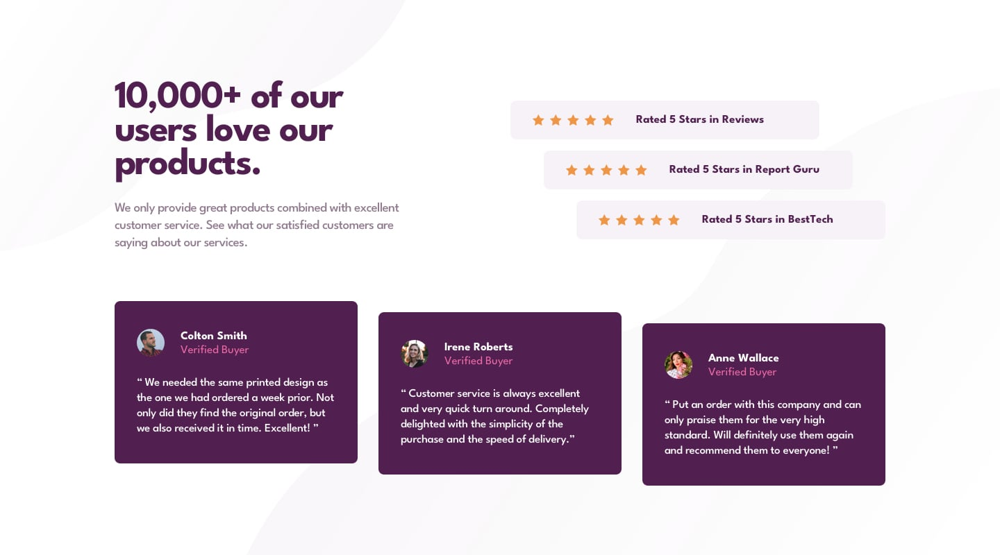

20. Fylo Data Storage Component => (https://abubakar-sadiq001.github.io/Front-end-Mentor-Challenges/19%20Social%20proof%20section/index.html)

### Desktop design

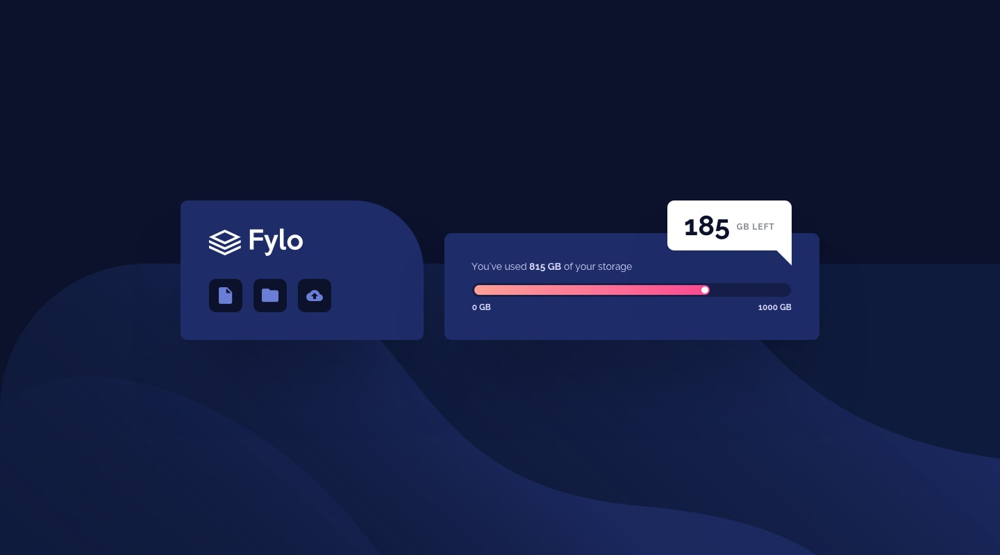

21. NFT Preview Card Component => (https://abubakar-sadiq001.github.io/Front-end-Mentor-Challenges/21%20NFT%20preview%20card%20component/index.html)

### Desktop design

22. Intro-section with drop down navigation => (https://abubakar-sadiq001.github.io/Front-end-Mentor-Challenges/22%20Intro-section-with-dropdown-navigation/index.html)

### Desktop design

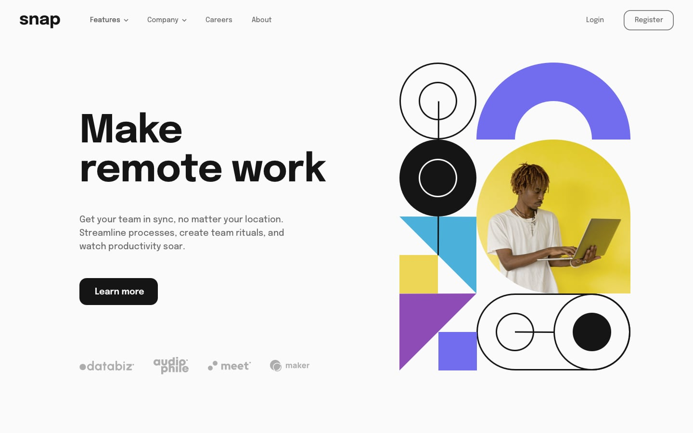

23. News home page => (https://abubakar-sadiq001.github.io/Front-end-Mentor-Challenges/23%20news-homepage-main/index.html)

### Desktop design

24. fylo-dark-theme-landing-page-master => (https://abubakar-sadiq001.github.io/Front-end-Mentor-Challenges/fylo-dark-theme-landing-page-master/)

25. Intro-component-with-signup-form-master => (https://abubakar-sadiq001.github.io/Front-end-Mentor-Challenges/25%20intro-component-with-signup-form-master/)

### Desktop design

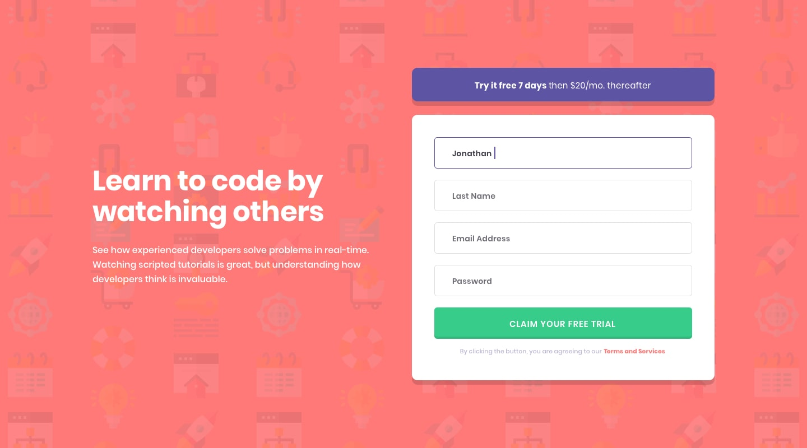

26. newsletter-sign-up-with-success-message-main => (https://abubakar-sadiq001.github.io/Front-end-Mentor-Challenges/26%20newsletter-sign-up-with-success-message-main/)

### Desktop design

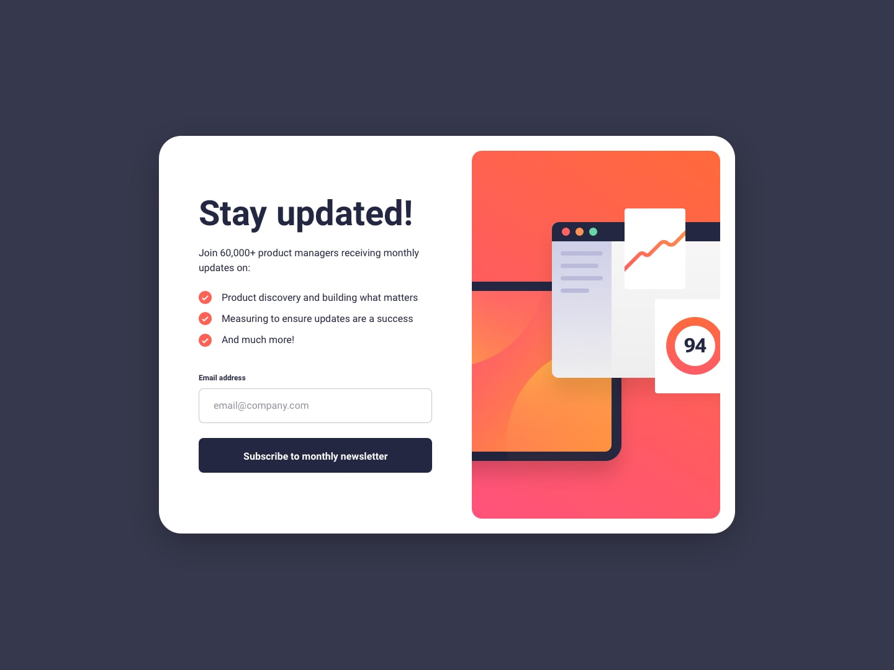

27. age-calculator-app-main => (https://abubakar-sadiq001.github.io/Front-end-Mentor-Challenges/27%20age-calculator-app-main/)

### Desktop design

28. ping-coming-soon-page-master => (https://abubakar-sadiq001.github.io/Front-end-Mentor-Challenges/28%20ping-coming-soon-page-master/)

### Desktop design

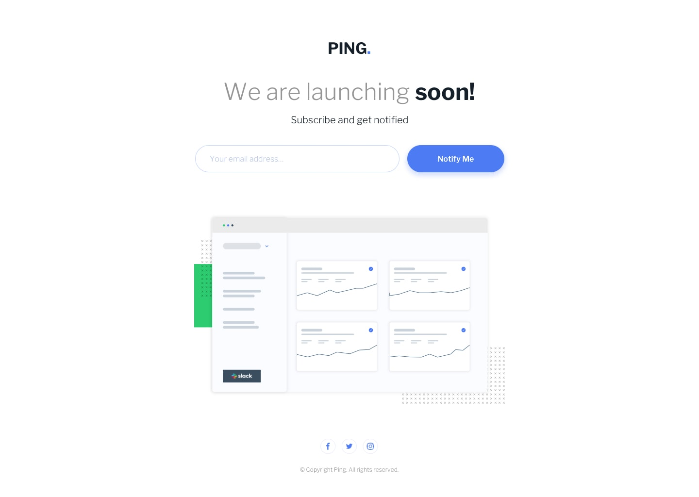

29. faq-accordion-main => (https://abubakar-sadiq001.github.io/Front-end-Mentor-Challenges/29%20faq-accordion-main/)

### Desktop design

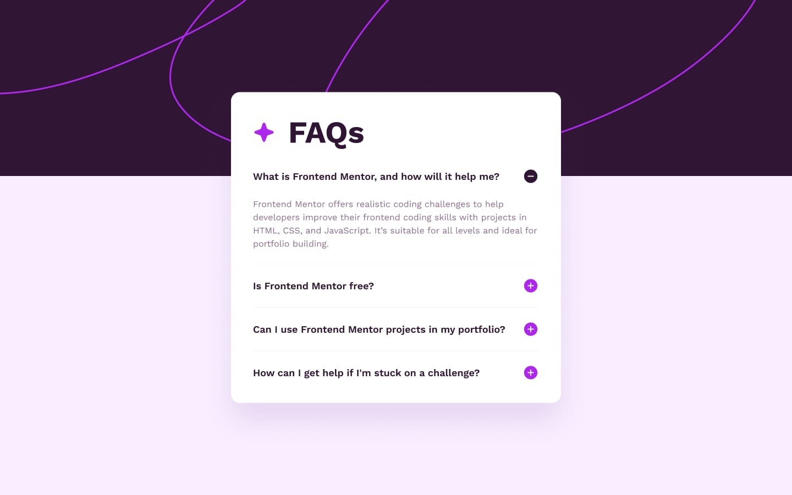

30. contact-form-main => (https://abubakar-sadiq001.github.io/Front-end-Mentor-Challenges/30%20contact-form-main/)

### Desktop design

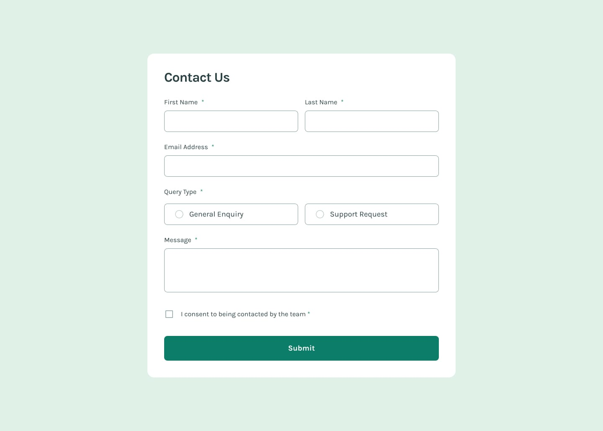

31. advice generator => (https://abubakar-sadiq001.github.io/Front-end-Mentor-Challenges/31%20Advice-generator-app-main/)

### Desktop design

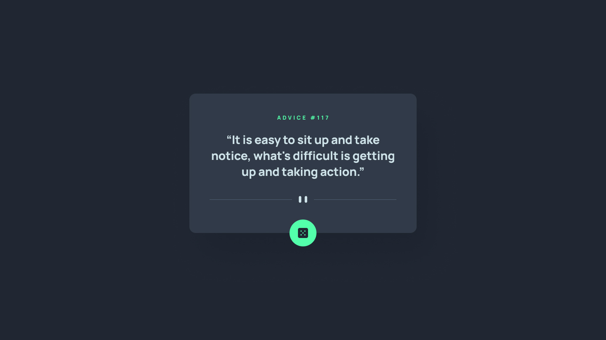

32. notification page => (https://abubakar-sadiq001.github.io/Front-end-Mentor-Challenges/32%20Notifications%20page/)

### Desktop design

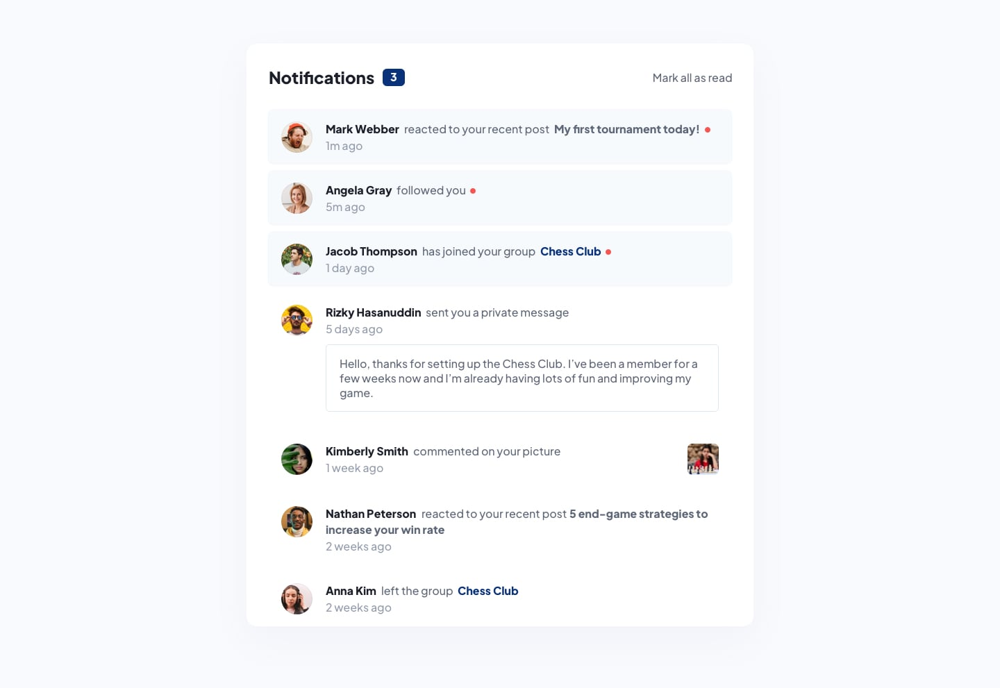

33. time-tracking-dashboard-main => (Working on these)

### Desktop design

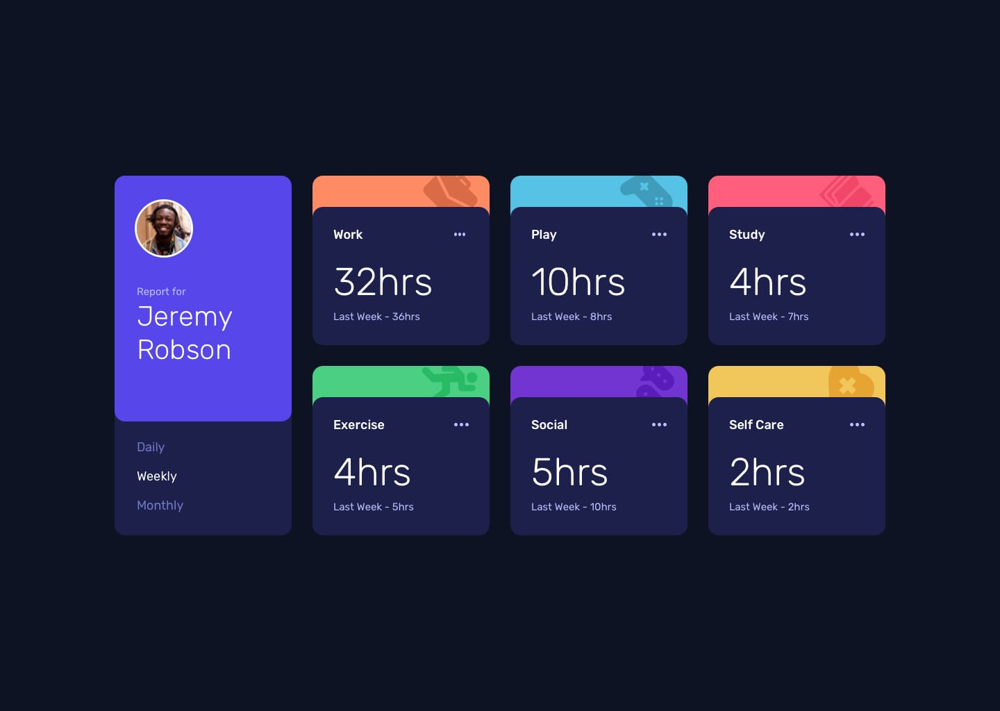

34. loopstudios-landing-page-main => (https://abubakar-sadiq001.github.io/Front-end-Mentor-Challenges/34%20loopstudios-landing-page-main/)

### Desktop design

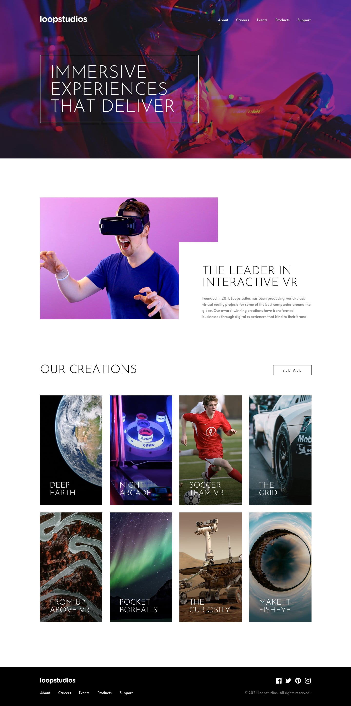

35 expenses-chart-component-main => (https://abubakar-sadiq001.github.io/Front-end-Mentor-Challenges/35%20Expenses-chart-component-main/)

### Desktop design

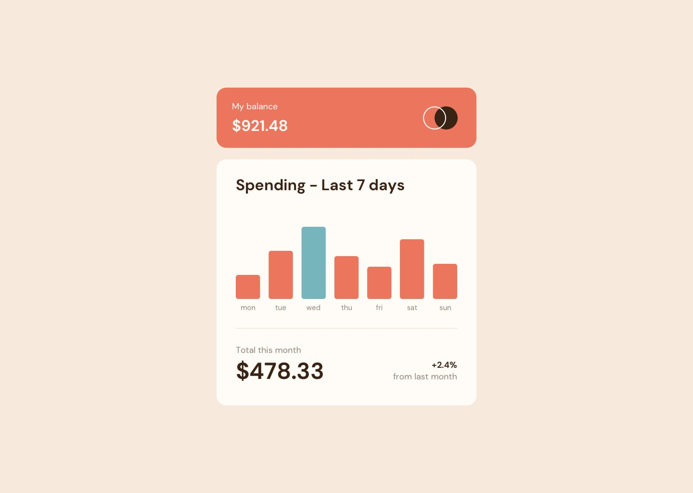

36. sunnyside-agency-landing-page-main => (https://abubakar-sadiq001.github.io/Front-end-Mentor-Challenges/36%20sunnyside-agency-landing-page-main/)

### Desktop design

37. tip-calculator-app-main => (https://abubakar-sadiq001.github.io/Front-end-Mentor-Challenges/37%20tip-calculator-app-main/)

### Desktop design

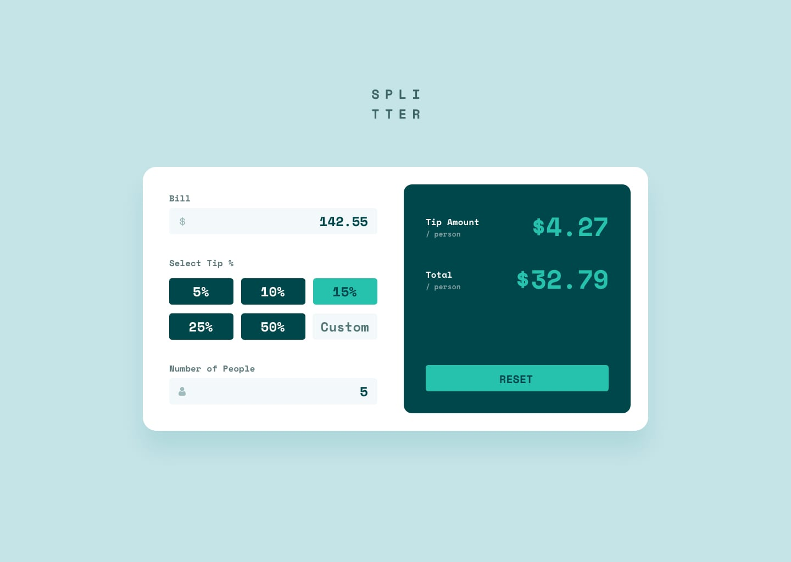

38. mortgage-repayment-calculator-main => (https://abubakar-sadiq001.github.io/Front-end-Mentor-Challenges/38%20mortgage-repayment-calculator-main/)

### Desktop design

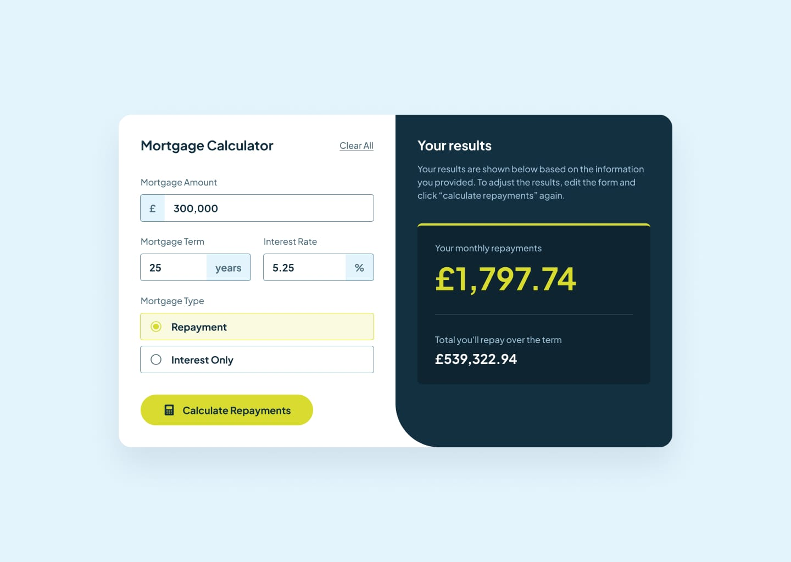
